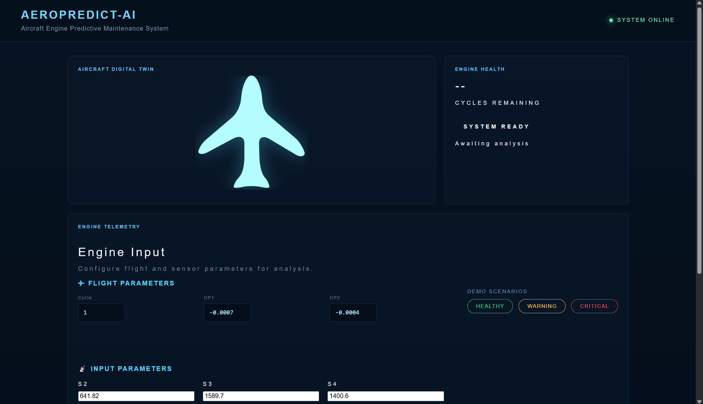
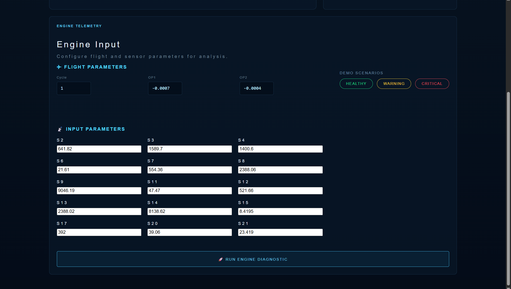
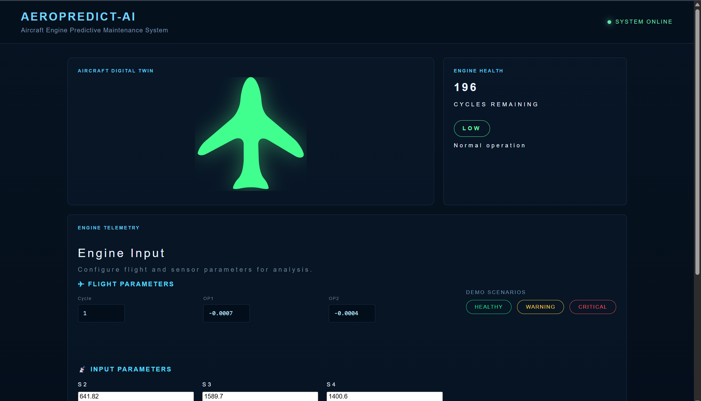
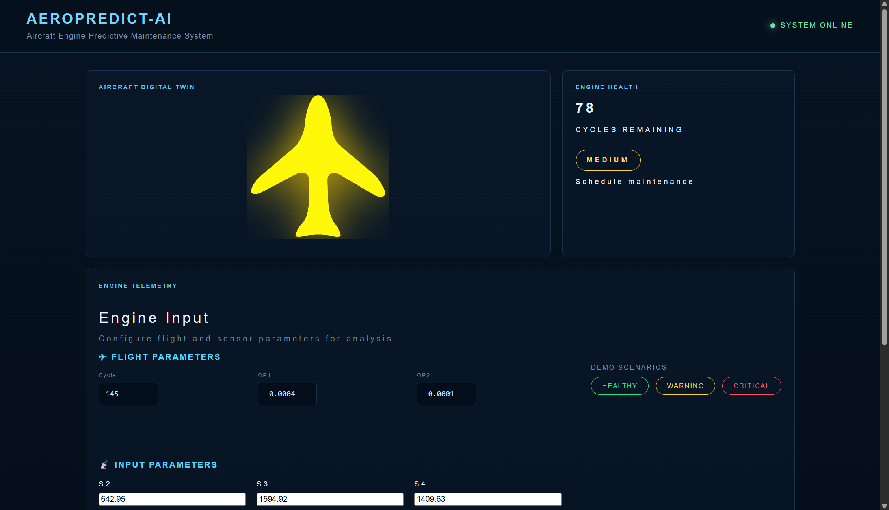
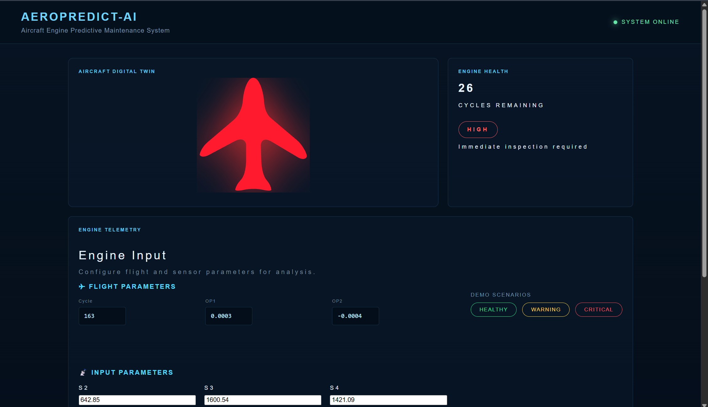

# ✈️ AeroPredict-AI

### AI-Powered Aircraft Engine Predictive Maintenance System

AeroPredict-AI is a machine-learning-powered predictive maintenance system that estimates the **Remaining Useful Life (RUL)** of aircraft engines using operational and sensor data.

The system combines a trained machine learning model, a **FastAPI backend**, and an interactive **React dashboard** to transform raw engine telemetry into an estimated remaining lifespan and an actionable engine health status.

---

## 🖥️ Dashboard



The AeroPredict-AI dashboard provides a visual interface for entering aircraft engine telemetry, running the machine learning model, and viewing the predicted engine health.



---

## 🚀 Features

- ✈️ Aircraft engine Remaining Useful Life (RUL) prediction
- 🤖 Machine-learning-based predictive maintenance
- 📊 Analysis of aircraft engine sensor telemetry
- 🚦 Automatic engine health classification
- 🟢 Healthy / 🟡 Warning / 🔴 Critical health states
- 🧪 Built-in engine demo scenarios
- ⚡ FastAPI prediction backend
- 💻 Interactive React dashboard
- 🔄 Frontend-to-backend ML prediction workflow
- 🎨 Dynamic aircraft health visualisation

---

## 🧠 Machine Learning Model

The predictive model estimates the **Remaining Useful Life (RUL)** of an aircraft engine in operational cycles.

Multiple machine learning approaches were explored during development, including:

- Random Forest Regressor
- XGBoost

After model evaluation and hyperparameter tuning, a tuned **Random Forest Regressor** was selected for the final system.

### Final Model Configuration

```python
RandomForestRegressor(
    n_estimators=100,
    max_depth=10,
    min_samples_leaf=5,
    max_features="sqrt",
    random_state=42,
    n_jobs=-1
)
```

### Model Performance

| Metric | Result |
|---|---:|
| MAE | 22.39 cycles |
| RMSE | 29.37 cycles |
| R² | 0.80 |

An **R² score of approximately 0.80** indicates that the model explains a substantial proportion of the variation in Remaining Useful Life within the evaluated data.

---

## 🚦 Engine Health Classification

The predicted RUL is converted into a health category so that the regression output can be interpreted more easily.

| Predicted RUL | Health Status | Interpretation |
|---|---|---|
| ≤ 40 cycles | 🔴 HIGH / CRITICAL | Immediate inspection required |
| 41–100 cycles | 🟡 MEDIUM / WARNING | Schedule maintenance |
| > 100 cycles | 🟢 LOW / HEALTHY | Engine operating normally |

The selected `40 / 100` RUL thresholds achieved approximately **85% overall classification accuracy** when predicted risk categories were compared with the corresponding actual RUL categories.

### Classification Performance

| Risk Level | Precision | Recall | F1-Score |
|---|---:|---:|---:|
| HIGH | 0.81 | 0.93 | 0.87 |
| MEDIUM | 0.70 | 0.69 | 0.70 |
| LOW | 0.92 | 0.90 | 0.91 |

**Overall Accuracy: 85%**

---

## 🧪 Demo Scenarios

AeroPredict-AI includes three predefined engine scenarios that allow the complete prediction pipeline to be demonstrated without manually entering every sensor value.

### 🟢 Healthy Engine

A healthy engine has a high predicted Remaining Useful Life and does not currently require maintenance intervention.



---

### 🟡 Warning Engine

The warning state represents an engine approaching a maintenance window.

Maintenance should be planned before the engine reaches a critical condition.



---

### 🔴 Critical Engine

A critical engine has low predicted Remaining Useful Life and requires immediate inspection.



---

## 📊 Dataset

AeroPredict-AI was developed using the **NASA C-MAPSS (Commercial Modular Aero-Propulsion System Simulation) aircraft engine degradation dataset**.

C-MAPSS simulates the degradation of turbofan engines over repeated operational cycles.

Each engine begins operation in a healthy state and progressively degrades until the end of its useful life.

The data contains:

- Engine operational cycles
- Operational settings
- Temperature measurements
- Pressure measurements
- Rotational speed measurements
- Additional aircraft engine sensor readings

The model learns degradation patterns from these measurements to estimate the engine's Remaining Useful Life.

---

## 📡 Model Inputs

The final prediction pipeline uses the following engine parameters:

### Operational Parameters

- Cycle
- Operational Setting 1
- Operational Setting 2

### Sensor Parameters

- Sensor 2
- Sensor 3
- Sensor 4
- Sensor 6
- Sensor 7
- Sensor 8
- Sensor 9
- Sensor 11
- Sensor 12
- Sensor 13
- Sensor 14
- Sensor 15
- Sensor 17
- Sensor 20
- Sensor 21

These values are entered through the dashboard and sent to the FastAPI backend for prediction.

---

## 🏗️ System Architecture

```text
           Aircraft Engine Telemetry
                      │
                      ▼
              React Dashboard
                      │
                      │ HTTP Request
                      ▼
                FastAPI Backend
                      │
                      ▼
              Feature Processing
                      │
                      ▼
          Random Forest RUL Model
                      │
                      ▼
               Predicted RUL
                      │
                      ▼
          Engine Risk Classification
                      │
              ┌───────┼───────┐
              ▼       ▼       ▼
           HEALTHY  WARNING  CRITICAL
```

---

## 🔄 Prediction Workflow

### 1. Engine Telemetry

The user enters aircraft operational and sensor parameters into the React dashboard.

### 2. API Request

The frontend sends the engine data to the FastAPI backend.

### 3. Feature Processing

The backend converts the received telemetry into the format expected by the trained machine learning model.

### 4. RUL Prediction

The Random Forest model estimates the engine's Remaining Useful Life.

### 5. Risk Classification

The predicted RUL is converted into one of three health states:

```text
RUL > 100       → HEALTHY
40 < RUL ≤ 100  → WARNING
RUL ≤ 40        → CRITICAL
```

### 6. Dashboard Update

The predicted RUL and health condition are returned to the React frontend and displayed to the user.

---

## 🛠️ Tech Stack

### Machine Learning

- Python
- Pandas
- NumPy
- Scikit-learn
- Joblib
- Jupyter Notebook

### Backend

- FastAPI
- Uvicorn
- Pydantic

### Frontend

- React
- JavaScript
- Vite
- CSS

### Development Tools

- Git
- GitHub
- VS Code

---

## 📁 Project Structure

```text
AeroPredict-AI/
│
├── backend/
│   ├── __init__.py
│   ├── main.py
│   ├── predictor.py
│   └── schemas.py
│
├── data/
│   ├── raw/
│   │   ├── train_FD001.txt
│   │   ├── test_FD001.txt
│   │   └── RUL_FD001.txt
│   │
│   └── processed/
│       └── sample_engine.csv
│
├── docs/
│   ├── Dashboard1.png
│   ├── Dashboard2.png
│   ├── Healthy-Demo.png
│   ├── Warning-Demo.png
│   └── Critical-Demo.png
│
├── frontend/
│   ├── public/
│   │   └── aircraft.svg
│   │
│   ├── src/
│   │   ├── App.jsx
│   │   ├── App.css
│   │   ├── index.css
│   │   └── main.jsx
│   │
│   ├── package.json
│   └── vite.config.js
│
├── models/
│   ├── aircraft_rul_model_tune.pkl
│   └── scaler.pkl
│
├── notebooks/
│   └── 01_eda.ipynb
│
├── src/
│   └── predict.py
│
├── .gitignore
├── LICENSE
├── README.md
└── requirements.txt
```

---

## ⚙️ Running AeroPredict-AI Locally

### 1. Clone the Repository

```bash
git clone <your-repository-url>
cd AeroPredict-AI
```

---

### 2. Install Python Dependencies

```bash
pip install -r requirements.txt
```

---

### 3. Start the FastAPI Backend

From the project root:

```bash
uvicorn backend.main:app --reload
```

The backend will start locally on port `8000`.

FastAPI also provides interactive API documentation at:

```text
http://127.0.0.1:8000/docs
```

---

### 4. Install Frontend Dependencies

Open another terminal:

```bash
cd frontend
npm install
```

---

### 5. Start the React Frontend

```bash
npm run dev
```

Vite will display the local development address in the terminal.

Usually:

```text
http://localhost:5173
```

Open the address in your browser to access the AeroPredict-AI dashboard.

---

## 🎯 Project Objective

Aircraft engines generate large amounts of operational and sensor data throughout their service life.

Instead of relying only on fixed maintenance intervals, predictive maintenance systems can analyse this data to identify degradation patterns and estimate when maintenance may be required.

AeroPredict-AI demonstrates how machine learning can be integrated into a full-stack application to support:

- Early detection of engine degradation
- Remaining Useful Life estimation
- Maintenance planning
- Reduced risk of unexpected engine failure
- Data-driven maintenance decisions

---

## 🔮 Future Improvements

Potential extensions to AeroPredict-AI include:

- 📡 Real-time aircraft sensor streaming
- ✈️ Multi-engine fleet monitoring
- 📈 Historical RUL trend visualisation
- 🚨 Automated maintenance alerts
- 🔍 Sensor anomaly detection
- 🧠 Deep learning RUL prediction models
- 📊 Model explainability using SHAP
- ☁️ Cloud deployment
- 🗄️ Historical prediction database
- 🌐 Support for additional C-MAPSS operating conditions

---

## 👨‍💻 Author

Developed by **Shevin**

Computer Science / Data Science Project

---

## 📄 License

This project is licensed under the terms provided in the repository's `LICENSE` file.